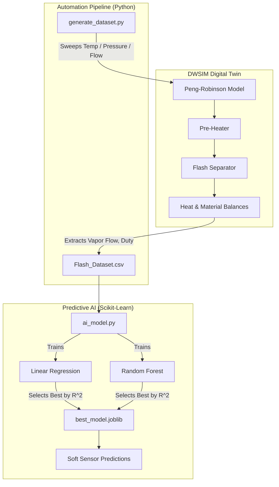

# DWSIM Digital Twin — Flash Separator Soft Sensor

A Python-driven digital twin of a flash separator, built on [DWSIM](https://dwsim.org/) (an open-source chemical process simulator). It sweeps feed temperature, pressure, and mass flow through the flowsheet, logs the resulting vapor flow, and trains a machine learning model that predicts vapor flow from those three feed conditions — a **soft sensor**: a cheap, instant proxy for a value that would otherwise require running the full simulation.

This is a common pattern in real process industries: expensive-to-compute or expensive-to-measure variables (energy duty, product quality, conversion) are predicted from readily available process variables using a model trained on simulation or historical data.

## How it works



1. **`generate_dataset.py`** drives DWSIM through its `.NET` `Automation3` API (via `pythonnet`), sweeps the feed stream's temperature (290–370 K), pressure (1–3 atm), and mass flow (1–5 kg/s) of `Flash_Model.dwxmz`, and records heater duty and vapor/liquid mass flows at each combination to `Flash_Dataset.csv`.
2. **`ai_model.py`** loads that CSV, trains a Linear Regression and a Random Forest model to predict `Vapor_Flow_kg_s` from feed temperature, pressure, and mass flow, picks the better model by R², saves it as `best_model.joblib`, and produces a parity plot (`parity_plot.png`) comparing actual vs. predicted values.

## Requirements

- **Windows**, with a local [DWSIM](https://dwsim.org/index.php/download/) installation (DWSIM runs on .NET; `pythonnet` needs the Windows CLR to load `DWSIM.Automation`).
- Python 3.10+
- Dependencies in `requirements.txt`

```bash
pip install -r requirements.txt
```

## Setup

1. Install DWSIM and note its install directory (default: `C:\Users\<you>\AppData\Local\DWSIM`).
2. Clone this repo — it already includes `Flash_Model.dwxmz`, the flowsheet used for data generation.
3. Point the scripts at your DWSIM install, either via CLI flags or environment variables:

```bash
# Option A: environment variables (set once)
set DWSIM_PATH=C:\Users\you\AppData\Local\DWSIM
set DWSIM_FLOWSHEET=D:\path\to\Flash_Model.dwxmz

# Option B: CLI flags (per run)
python generate_dataset.py --dwsim-path "C:\Users\you\AppData\Local\DWSIM" --flowsheet "D:\path\to\Flash_Model.dwxmz"
```

## Usage

Run the two scripts **in order**:

```bash
python generate_dataset.py   # drives DWSIM, produces Flash_Dataset.csv (1,025 points by default)
python ai_model.py           # trains the soft sensor, produces best_model.joblib + parity_plot.png
```

The default sweep covers 41 temperatures × 5 pressures × 5 mass flows = 1,025 combinations, and takes noticeably longer than a single-variable sweep. Ranges are adjustable via CLI flags — see `python generate_dataset.py --help`.

Sample output from `ai_model.py`:

```
Linear Regression R2 Score: 0.0563
Random Forest R2 Score: 0.9330
Selected Best Model: Random Forest (R2 = 0.9330)
...
VIRTUAL SOFT SENSOR PREDICTION:
If the incoming feed is 325 K, 1.5 atm, 2.0 kg/s...
The Random Forest AI predicts the Vapor Flow will be: 0.0000 kg/s
```

> **Note on the two scores:** Linear Regression's R² is much lower than Random Forest's here — this is expected, not a bug. Vapor flow stays at exactly 0 below ~358 K, then turns on with a non-linear, pressure- and flow-dependent response above that threshold. Linear Regression can't represent a sharp on/off threshold like this; Random Forest can, since it learns branching decision rules that match the real underlying physics.

## Interactive Demo

Run `streamlit run app.py` for a browser-based interface with sliders for feed Temperature, Pressure, and Mass Flow — get an instant predicted Vapor Flow, with built-in warnings when any input falls outside the model's training range.


## Scope and limitations

- The pre-heater block adds a **fixed** amount of heat (kW) to the feed, regardless of flow rate — so Heater_Duty is constant in the dataset and is not a useful prediction target; Vapor_Flow is the variable that actually responds to the swept inputs.
- The DWSIM solver can fail to converge at some sweep points; `generate_dataset.py` skips those points and logs why, instead of quitting on the first `except`.
- Tested against a single flowsheet topology (`Flash_Model.dwxmz`, with a pre-heater feeding an adiabatic flash drum); object tag names (`FEED`, `VAP OUT`, `LIQ OUT`, `E1`) must match your flowsheet if you swap it out.
- Composition is not yet swept or predicted — all runs use a fixed feed composition.

## Possible next steps

- FastAPI endpoint that loads `best_model.joblib` and serves live soft-sensor predictions.
- Multi-output model (vapor flow + liquid flow + duty) from the existing dataset.
- Sweep feed composition as an additional input.

## Related project

This project is a companion to [DWSIM-HMB-Stream-Populator](https://github.com/aniketthakre24official/DWSIM-HMB-Stream-Populator), a tool that auto-configures DWSIM streams from structured HMB data. Together, they demonstrate working with the DWSIM automation API in both directions — reading simulation results out, and writing structured data in.

## License

MIT — see [LICENSE](LICENSE).
