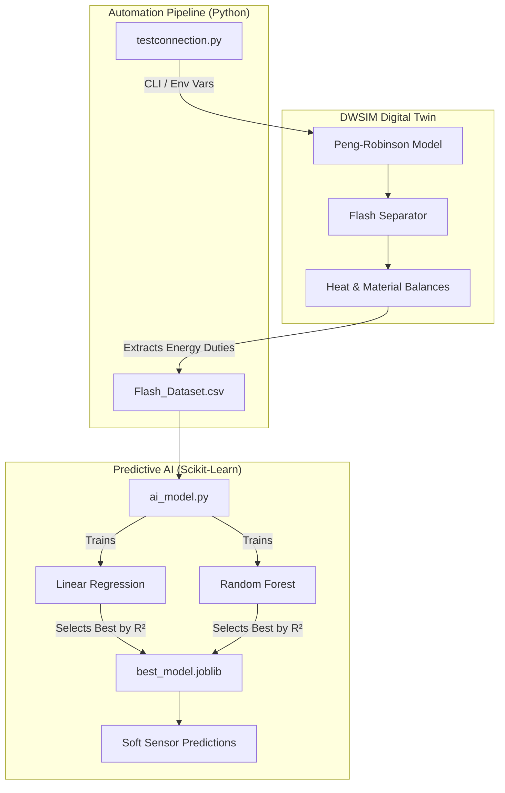

```mermaid
graph TD
    subgraph "DWSIM Digital Twin"
        A[Peng-Robinson Model] --> B[Flash Separator]
        B --> C[Heat & Material Balances]
    end

    subgraph "Automation Pipeline (Python)"
        D[testconnection.py] -->|CLI / Env Vars| A
        C -->|Extracts Energy Duties| E[Flash_Dataset.csv]
    end

    subgraph "Predictive AI (Scikit-Learn)"
        E --> F[ai_model.py]
        F -->|Trains| G[Linear Regression]
        F -->|Trains| H[Random Forest]
        G & H -->|Selects Best by R²| I[best_model.joblib]
        I --> J[Soft Sensor Predictions]
    end
```
