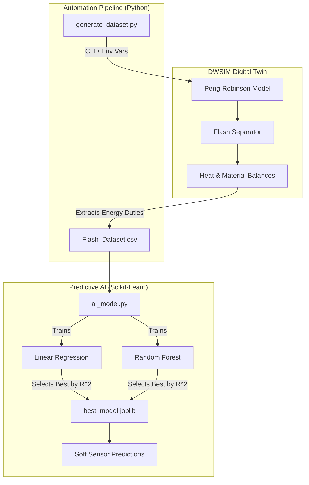
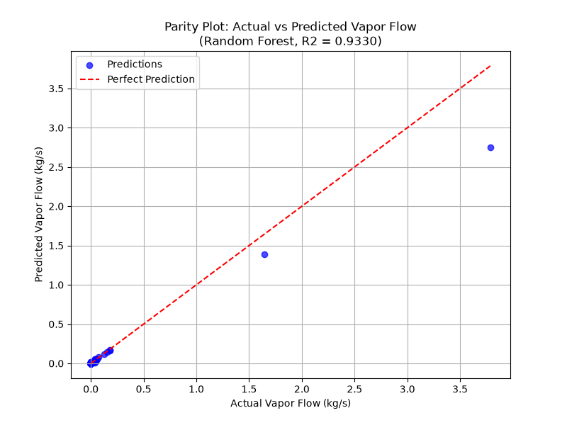

# DWSIM Digital Twin — Flash Separator Soft Sensor

A Python-driven digital twin of a flash separator, built on [DWSIM](https://dwsim.org/) (an open-source chemical process simulator). It sweeps feed temperature through the flowsheet, logs the resulting heater duty, and trains a machine learning model that predicts heater duty from feed temperature alone — a **soft sensor**: a cheap, instant proxy for a value that would otherwise require running the full simulation.

This is a common pattern in real process industries: expensive-to-compute or expensive-to-measure variables (energy duty, product quality, conversion) are predicted from readily available process variables using a model trained on simulation or historical data.

## How it works



1. **`generate_dataset.py`** drives DWSIM through its `.NET` `Automation3` API (via `pythonnet`), sweeps the feed temperature of `Flash_Model.dwxmz` from 290 K to 370 K in 2 K steps, and records heater duty and vapor/liquid mass flows at each point to `Flash_Dataset.csv`.
2. **`ai_model.py`** loads that CSV, trains a Linear Regression and a Random Forest model to predict `Heater_Duty_kW` from `Feed_Temperature_K`, picks the better model by R², saves it as `best_model.joblib`, and produces a parity plot (`parity_plot.png`) comparing actual vs. predicted values.

## Requirements

- **Windows**, with a local [DWSIM](https://dwsim.org/index.php/download/) installation (DWSIM runs on .NET; `pythonnet` needs the Windows CLR to load `DWSIM.Automation`).
- Python 3.10+
- Dependencies in `requirements.txt`

```bash
pip install -r requirements.txt
```

## Setup

1. Install DWSIM and note its install directory (default: `C:\Users\<you>\AppData\Local\DWSIM`).
2. Clone this repo — it already includes `Flash_Model.dwxmz`, the flowsheet used for data generation.
3. Point the scripts at your DWSIM install, either via CLI flags or environment variables:

```bash
# Option A: environment variables (set once)
set DWSIM_PATH=C:\Users\you\AppData\Local\DWSIM
set DWSIM_FLOWSHEET=D:\path\to\Flash_Model.dwxmz

# Option B: CLI flags (per run)
python generate_dataset.py --dwsim-path "C:\Users\you\AppData\Local\DWSIM" --flowsheet "D:\path\to\Flash_Model.dwxmz"
```

## Usage

Run the two scripts **in order**:

```bash
python generate_dataset.py   # drives DWSIM, produces Flash_Dataset.csv
python ai_model.py           # trains the soft sensor, produces best_model.joblib + parity_plot.png
```

Sample output from `ai_model.py`:

```
Linear Regression R2 Score: 0.94xx
Random Forest R2 Score: 0.9xxx
Selected Best Model: Random Forest (R2 = 0.9xxx)
...
VIRTUAL SOFT SENSOR PREDICTION:
If the incoming feed spikes to 325 K...
The Random Forest AI predicts the Heater Duty will adjust to: xx.xx kW
```

*(Run it once and paste your real numbers here — recruiters read this line.)*



*(Generate `parity_plot.png` locally and commit it so this renders on GitHub.)*

## Scope and limitations

- Only feed temperature is swept, and only heater duty is predicted. Vapor and liquid mass flow are logged in the dataset but not yet modeled — extending `ai_model.py` to predict all three (or sweeping additional inputs like feed pressure/composition) would make this closer to a full-behavior twin rather than one learned curve.
- The DWSIM solver can fail to converge at some sweep points; `generate_dataset.py` now skips those points and logs why, instead of quitting on the first `except`.
- Tested against a single flowsheet topology (`Flash_Model.dwxmz`); object tag names (`FEED`, `VAP OUT`, `LIQ OUT`, `E1`) must match your flowsheet if you swap it out.

## Possible next steps

- FastAPI endpoint that loads `best_model.joblib` and serves live soft-sensor predictions.
- Multi-output model (duty + both flows) from the existing dataset.
- Sweep additional inputs (feed pressure, composition) for a richer twin.

## License

MIT — see [LICENSE](LICENSE).
